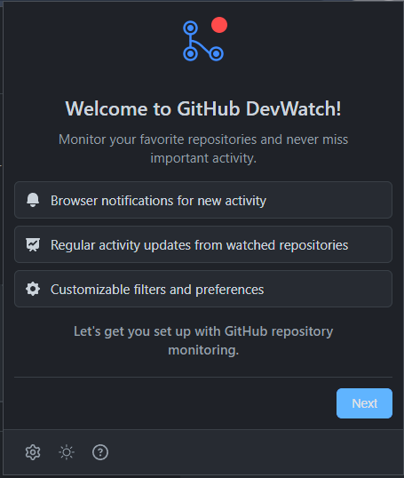
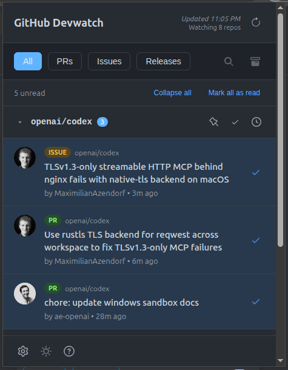
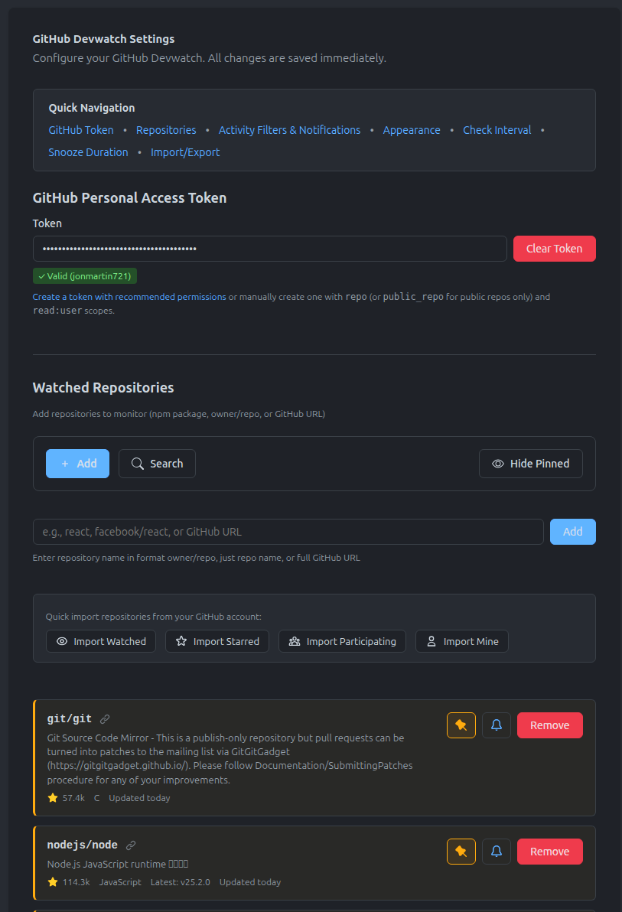
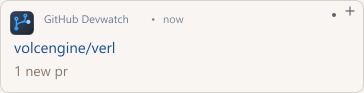

# GitHub Devwatch for Chrome

Track GitHub activity across multiple repos. Get notifications for new PRs, issues, and releases without constantly refreshing.

[](https://chrome.google.com/webstore)
[](LICENSE)
[](https://github.com/jonmartin721/devwatch-github/actions)
[](https://codecov.io/gh/jonmartin721/devwatch-github)

## Key Features

- **Guided Setup** - 2-minute wizard walks you through token creation and repo selection
- **Browser Notifications** - Get notified about new PRs, issues, and releases
- **Multi-Repo Monitoring** - Watch up to 50 repositories from one interface
- **Configurable Updates** - Check every 5, 15, 30, or 60 minutes
- **Activity Filtering** - Search and filter by repo and activity type
- **Badge Counts** - Unread count on the extension icon
- **Secure & Private** - Your token stays local, zero third-party data sharing

## Screenshots

### Guided Setup Wizard
<div align="center">
  
  <br><em>Interactive setup wizard guides you through configuration in under 2 minutes</em>
</div>

### Extension Interface
<table>
  <tr>
    <td width="50%">
      
      <br><em>Popup interface with activity feed and filtering</em>
    </td>
    <td width="50%">
      
      <br><em>Settings page with repository management</em>
    </td>
  </tr>
  <tr>
    <td width="50%">
      
      <br><em>Real-time browser notifications</em>
    </td>
    <td width="50%">
      
      <br><em>Badge showing unread activity count</em>
    </td>
  </tr>
</table>

## Installation

### From Chrome Web Store (Recommended)

1. Visit the Chrome Web Store (coming soon)
2. Click "Add to Chrome"
3. Grant permissions when prompted
4. Follow the guided setup wizard on first launch

### Manual Installation (For Development)

1. Clone this repository
```bash
git clone https://github.com/jonmartin721/devwatch-github.git
cd devwatch-github
```

2. Load the extension in Chrome:
   - Open Chrome and go to `chrome://extensions/`
   - Enable "Developer mode" (toggle in top right)
   - Click "Load unpacked"
   - Select the extension directory

3. Click the extension icon and follow the setup wizard

## Quick Setup

### First-Time Setup
When you first install the extension, an **interactive setup wizard** guides you through:

1. **Welcome** - Overview of features and capabilities
2. **GitHub Token** - Create and validate your personal access token with step-by-step instructions
3. **Add Repositories** - Select which repositories to monitor
4. **Activity Preferences** - Choose which types of activity to track (PRs, Issues, Releases)
5. **Done!** - Start monitoring immediately

The entire setup takes about 2 minutes and requires no prior configuration knowledge.

### Ongoing Use
- The extension automatically checks for activity at your configured interval (default: 15 minutes)
- Click the extension icon to view your activity feed
- Get browser notifications for new activity
- Badge count shows unread items at a glance
- Manage repositories and preferences anytime in Settings

## How to Use

### Popup Interface
- **Tabs**: Filter between All/PRs/Issues/Releases
- **Search**: Filter activities by keyword
- **Refresh**: Manually check for new activity
- **Archive**: View previously read activities
- **Activity Items**: Click to open in GitHub

### Settings Page
- **GitHub Token**: Secure storage of your personal access token
- **Watched Repositories**: Add/remove repositories, import from GitHub
- **Activity Filters**: Choose what types of activity to monitor
- **Feed Management**: Control how long items are stored (up to 2000 items, optional time-based expiry)
- **Check Interval**: Configure how often to check for updates
- **Notifications**: Toggle browser notifications on/off
- **Theme**: Choose dark, light, or system theme
- **Backup/Restore**: Export and import your settings

## Typical Workflow

Here's what using the extension looks like day-to-day:

1. You're working and get a notification: "2 new activities in your-org/api-server"
2. Click the extension icon to see the feed
3. See "Pull Request #145: Add OAuth2 authentication" (3 minutes ago)
4. Click the item to open it in GitHub
5. Review and comment on the PR
6. When you return to the extension, it's marked as read

The extension keeps up to 2000 items in your local history, so you can always check something you saw earlier. Badge count updates automatically as you read items.

## Accessibility

GitHub Devwatch is built with accessibility in mind to ensure everyone can use it effectively:

### WCAG 2.1 Level A Compliance
- **Form Labels**: All form inputs have proper visible labels for screen readers
- **Keyboard Navigation**: Full keyboard support with intuitive shortcuts
- **Focus Management**: Proper focus indicators and logical tab order
- **ARIA Landmarks**: Semantic HTML with proper ARIA roles and labels
- **Screen Reader Support**: Descriptive labels and live region announcements

### Keyboard Shortcuts
- **R** - Refresh activity
- **S** - Toggle search
- **A** - Toggle archive view
- **Escape** - Close modals and search
- **Arrow Keys** - Navigate between filter tabs
- **Enter/Space** - Activate buttons and links

### Testing & Validation
- Automated accessibility testing with axe-core
- Manual testing with NVDA and JAWS screen readers
- Keyboard-only navigation verified
- Focus trap implementation in modals

For accessibility issues or suggestions, please [open an issue](https://github.com/jonmartin721/devwatch-github/issues).

## Privacy & Security

Your GitHub token is encrypted and stays securely on your machine. The extension only communicates with GitHub's API - no analytics, no tracking, no third-party services.

- **Encrypted Storage** - Tokens are encrypted using industry-standard AES-GCM encryption and stored locally in Chrome's secure storage with session caching for optimal performance
- **Local Storage Only** - All data stays on your machine, never sent to third-party servers
- **API-Only Communication** - Only talks to GitHub's official API
- **No Third Parties** - Zero external servers or analytics services
- **Minimal Permissions** - Token used exclusively for fetching repository activity
- **Open Source** - Review the entire codebase, raise issues, or submit fixes

## Data Storage

The extension stores up to **2000 activity items** locally in Chrome storage. This limit ensures the extension stays performant while providing plenty of history.

### Feed Management
You can optionally configure automatic expiry of old items:
- **Auto-removal**: Enable time-based expiry to automatically remove items older than a specified time
- **Configurable Duration**: Set expiry time from 1 to 168 hours (1 week)
- **Applies to All Items**: When enabled, both feed and archived items older than the threshold are removed
- **Manual Control**: Clear archive manually anytime with the "Clear Archive" button

Items are automatically removed when they exceed the 2000 item limit (keeping the most recent) or when they're older than your configured expiry time (if enabled).

## Rate Limiting

GitHub gives authenticated users 5,000 API requests per hour. Each repo check uses 1-3 requests, so even checking 50 repos every 15 minutes keeps you well under the limit.

The extension defaults to checking every 15 minutes. You can change this to 5, 30, or 60 minutes in settings. The 50-repo limit is just to keep things reasonable - you won't hit GitHub's rate limits even at that level.

## Development

### Project Structure
```
/devwatch-github
  /icons                  # Extension icons in various sizes
  /popup                  # Popup interface
    /controllers         # Popup business logic
    /views               # Popup view components
    popup.html
    popup.js
    popup.css
  /options                # Settings page
    /controllers         # Settings business logic
    /views               # Settings view components
    options.html
    options.js
  /shared                 # Shared utilities
    /api                 # GitHub API integration
    /ui                  # Shared UI components
  background.js           # Service worker for background tasks
  manifest.json           # Extension manifest (Manifest V3)
```

### Technologies Used
- **Vanilla JavaScript** - No frameworks, pure JS for maximum compatibility
- **Chrome Extension Manifest V3** - Latest extension standards
- **GitHub REST API** - Direct integration with GitHub's API
- **Chrome APIs** - Storage, Notifications, and Alarms for core functionality

### Running Tests
```bash
npm test
```

### Local Development
1. Clone the repository
2. Run `npm install` for dependencies
3. Load as unpacked extension in Chrome
4. Make changes and reload the extension from `chrome://extensions/`

## Contributing

Contributions welcome! Submit issues or pull requests. See [CONTRIBUTING.md](CONTRIBUTING.md) for guidelines.

### How to Contribute
- **Bug Reports**: Use GitHub Issues with clear reproduction steps
- **Feature Requests**: Open an issue describing the feature and use case
- **Pull Requests**: Fork, branch, and submit with clear commit messages
- **Code Style**: Follow existing patterns and use ESLint configuration

## Documentation

- [**Privacy Policy**](PRIVACY.md) - How we handle your data
- [**Changelog**](CHANGELOG.md) - Version history and release notes
- [**License**](LICENSE) - MIT License
- [**Contributing Guidelines**](CONTRIBUTING.md) - How to contribute

## Roadmap

Features I'm considering (no promises on timeline - this is a side project):
- **Comment notifications** - Track new comments on issues and PRs
- **Mention tracking** - Get notified when you're mentioned
- **Multiple GitHub accounts** - Switch between different accounts
- **Custom notification filters** - Advanced filtering rules
- **Internationalization** - Support for multiple languages
- **Dashboard view** - Full-page dashboard for all activity
- **Integration with other platforms** - GitLab, Bitbucket support

If any of these sound useful, open an issue or submit a PR!

## License

MIT License - see [LICENSE](LICENSE) file for details.

Copyright (c) 2025 Jonathan Martin

## Support

- **Report issues**: [GitHub Issues](https://github.com/jonmartin721/devwatch-github/issues)
- **Feature requests**: [GitHub Discussions](https://github.com/jonmartin721/devwatch-github/discussions)

---

<div align="center">

[⭐ Star this repo](https://github.com/jonmartin721/devwatch-github) if you find it useful!

</div>
