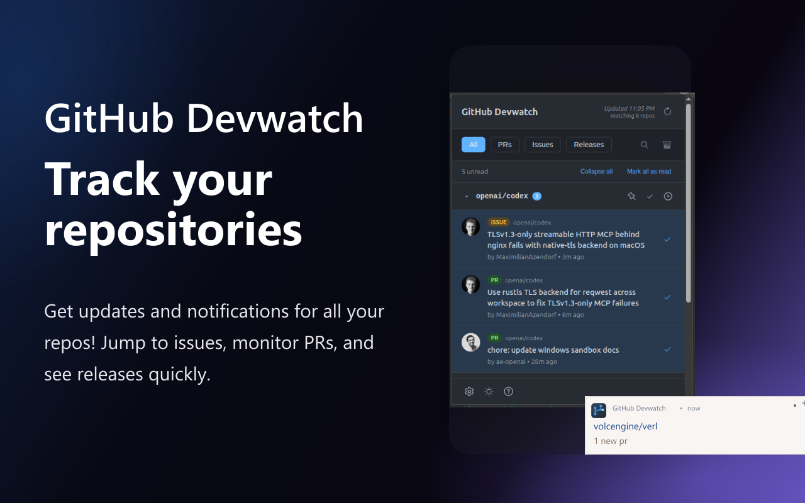
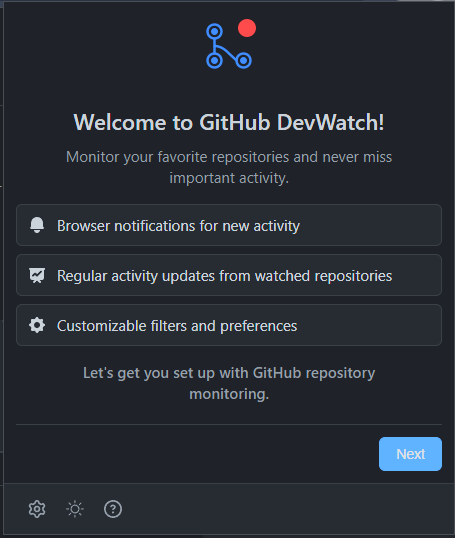
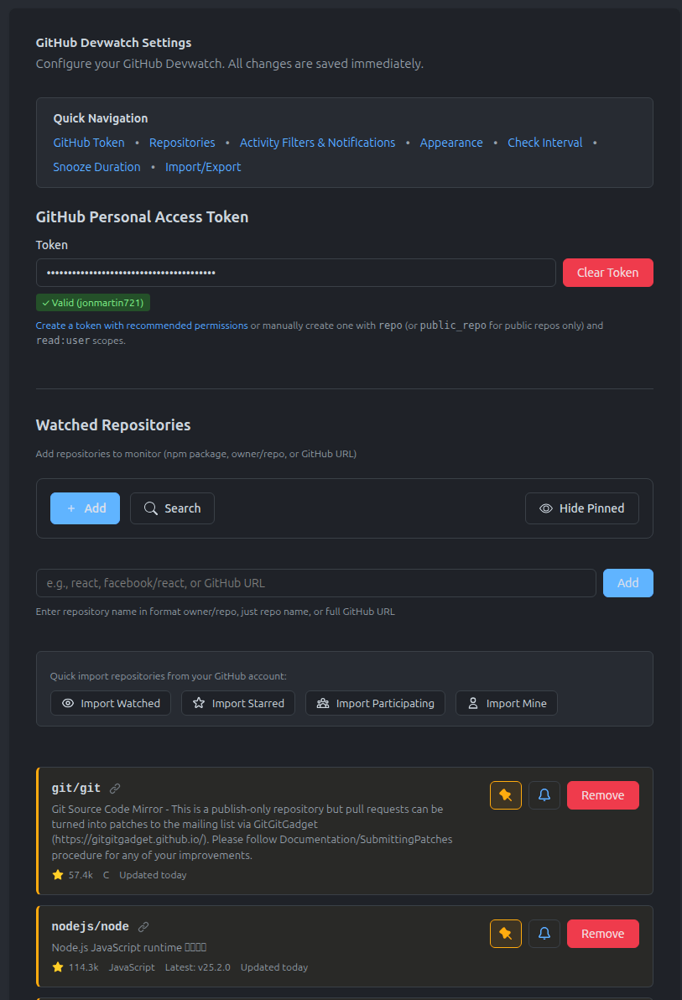
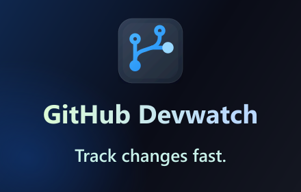

# GitHub Devwatch for Chrome

Monitor pull requests, issues, and releases across multiple GitHub repositories from a Chrome extension. It keeps a local activity feed, badge counts, and optional browser notifications without adding another hosted service to the workflow.

[](https://chromewebstore.google.com/detail/github-devwatch/dbgjgcaphfcfgppicmbiafcgcabikjch)
[](LICENSE)
[](https://github.com/jonmartin721/devwatch-github/actions)
[](https://codecov.io/gh/jonmartin721/devwatch-github)

## Key Features

- **Guided Setup** - Built-in setup flow for token creation and repository selection
- **Browser Notifications** - Get notified about new PRs, issues, and releases
- **Multi-Repo Monitoring** - Watch up to 50 repositories from one interface
- **Configurable Updates** - Check every 5, 15, 30, or 60 minutes
- **Activity Filtering** - Search and filter by repo and activity type
- **Badge Counts** - Unread count on the extension icon
- **Direct API Access** - Talks to GitHub directly, with optional npm registry lookups only when you use package-name import

<div align="center">
  
</div>

## Installation

### From Chrome Web Store (Recommended)

1. Visit the [Chrome Web Store](https://chromewebstore.google.com/detail/github-devwatch/dbgjgcaphfcfgppicmbiafcgcabikjch)
2. Click "Add to Chrome"
3. Grant permissions when prompted
4. Follow the guided setup wizard on first launch

**GitHub Token Permissions**: You'll need a [Personal Access Token](https://github.com/settings/tokens/new) with `repo` (for private repos) or `public_repo` (for public only).

### Manual Installation (For Development)

1. Clone this repository
```bash
git clone https://github.com/jonmartin721/devwatch-github.git
cd devwatch-github
```

2. Load the extension in Chrome:
   - Open Chrome and go to `chrome://extensions/`
   - Enable "Developer mode" (toggle in top right)
   - Click "Load unpacked"
   - Select the extension directory

3. Click the extension icon and follow the setup wizard

## Quick Setup

### First-Time Setup

The built-in setup flow walks you through:
1. Create a GitHub token
2. Add repositories to watch
3. Choose activity types (PRs, Issues, Releases)

<div align="center">
  
</div>

### Ongoing Use
- The extension automatically checks for activity at your configured interval (default: 15 minutes)
- Click the extension icon to view your activity feed
- Get browser notifications for new activity
- Badge count shows unread items at a glance
- Manage repositories and preferences anytime in Settings

## How to Use

### Popup Interface
Filter by type (All/PRs/Issues/Releases), search activities, refresh manually, or browse the archive. Click any item to open in GitHub.

### Settings Page
Manage your GitHub token, watched repositories, activity filters, check interval, notifications, and theme. Export/import settings for backup.

<div align="center">
  
</div>

## Typical Workflow

Here's what using the extension looks like day-to-day:

1. You're working and get a notification: "2 new activities in your-org/api-server"
2. Click the extension icon to see the feed
3. See "Pull Request #145: Add OAuth2 authentication" (3 minutes ago)
4. Click the item to open it in GitHub
5. Review and comment on the PR
6. When you return to the extension, it's marked as read

The extension keeps up to 2000 items in your local history, so you can always check something you saw earlier. Badge count updates automatically as you read items.

## Accessibility Notes

The UI includes keyboard navigation, visible focus styles, semantic controls, and ARIA labeling in key flows. The test suite also includes automated axe-core checks and keyboard-focused UI tests.

That said, this project has not gone through a formal accessibility audit or documented screen reader certification. If you run into an accessibility issue, please [open an issue](https://github.com/jonmartin721/devwatch-github/issues).

## Privacy & Security Notes

The extension talks directly to GitHub's API and does not use a separate analytics or sync backend. It stores settings and cached activity in Chrome extension storage, and the current build encrypts the GitHub token before persisting it locally while keeping a decrypted session copy available at runtime.

- **Direct network access** - Requests go to `api.github.com`, plus `registry.npmjs.org` only when you use package-name lookup
- **Scoped browser permissions** - The manifest asks for `storage`, `alarms`, and `notifications`
- **Defensive client code** - The codebase includes URL validation, content security policy rules, and sanitization tests
- **No formal audit claim** - These measures improve the local handling of data, but they are not a substitute for securing the browser profile and GitHub account you use with the extension

## Data Storage

The extension stores up to **2000 activity items** locally in Chrome storage. This limit ensures the extension stays performant while providing plenty of history.

### Feed Management
You can optionally configure automatic expiry of old items:
- **Auto-removal**: Enable time-based expiry to automatically remove items older than a specified time
- **Configurable Duration**: Set expiry time from 1 to 168 hours (1 week)
- **Applies to All Items**: When enabled, both feed and archived items older than the threshold are removed
- **Manual Control**: Clear archive manually anytime with the "Clear Archive" button

Items are automatically removed when they exceed the 2000 item limit (keeping the most recent) or when they're older than your configured expiry time (if enabled).

## Rate Limiting

GitHub gives authenticated users 5,000 API requests per hour. Each repo check uses 1-3 requests, so even checking 50 repos every 15 minutes keeps you well under the limit.

The extension defaults to checking every 15 minutes. You can change this to 5, 30, or 60 minutes in settings. The 50-repo limit is just to keep things reasonable - you won't hit GitHub's rate limits even at that level.

## Development

### Project Structure
```
/devwatch-github
  /icons                  # Extension icons in various sizes
  /popup                  # Popup interface
    /controllers         # Popup business logic
    /views               # Popup view components
    popup.html
    popup.js
    popup.css
  /options                # Settings page
    /controllers         # Settings business logic
    /views               # Settings view components
    options.html
    options.js
  /shared                 # Shared utilities
    /api                 # GitHub API integration
    /ui                  # Shared UI components
  background.js           # Service worker for background tasks
  manifest.json           # Extension manifest (Manifest V3)
```

### Technologies Used
- **Vanilla JavaScript** - No frameworks, pure JS for maximum compatibility
- **Chrome Extension Manifest V3** - Latest extension standards
- **GitHub REST API** - Direct integration with GitHub's API
- **Chrome APIs** - Storage, Notifications, and Alarms for core functionality

### Running Tests
```bash
npm run lint
npm run typecheck
npm test
npm run build
```

The automated checks cover shared logic, UI behavior, and a range of mocked extension flows. They do not replace manual testing in Chrome for permissions, service worker lifecycle behavior, or end-to-end interactions against live GitHub data.

Jest enforces minimum global coverage thresholds of 47% lines, 46% branches, and 44% functions. That is a floor for the suite, not a claim of exhaustive coverage.

### Local Development
1. Clone the repository
2. Run `npm install` for dependencies
3. Load as unpacked extension in Chrome
4. Make changes and reload the extension from `chrome://extensions/`

## Contributing

Contributions welcome! Submit issues or pull requests. See [CONTRIBUTING.md](CONTRIBUTING.md) for guidelines.

### How to Contribute
- **Bug Reports**: Use GitHub Issues with clear reproduction steps
- **Feature Requests**: Open an issue describing the feature and use case
- **Pull Requests**: Fork, branch, and submit with clear commit messages
- **Code Style**: Follow existing patterns and use ESLint configuration

## Documentation

- [**Privacy Policy**](PRIVACY.md) - How we handle your data
- [**Changelog**](CHANGELOG.md) - Version history and release notes
- [**License**](LICENSE) - MIT License
- [**Contributing Guidelines**](CONTRIBUTING.md) - How to contribute

## Roadmap

This is an actively maintained side project. Some features under consideration:
- **Comment notifications** - Track new comments on issues and PRs
- **Mention tracking** - Get notified when you're mentioned
- **Multiple GitHub accounts** - Switch between different accounts
- **GitHub OAuth** - Simplified authentication with one-click login
- **Internationalization** - Support for multiple languages
- **Dashboard view** - Full-page dashboard for all activity

If any of these sound useful, open an issue or submit a PR!

## License

MIT License - see [LICENSE](LICENSE) file for details.

Copyright (c) 2025 Jonathan Martin

## Support

- **Report issues**: [GitHub Issues](https://github.com/jonmartin721/devwatch-github/issues)
- **Feature requests**: [GitHub Discussions](https://github.com/jonmartin721/devwatch-github/discussions)

---

<div align="center">
  
</div>
